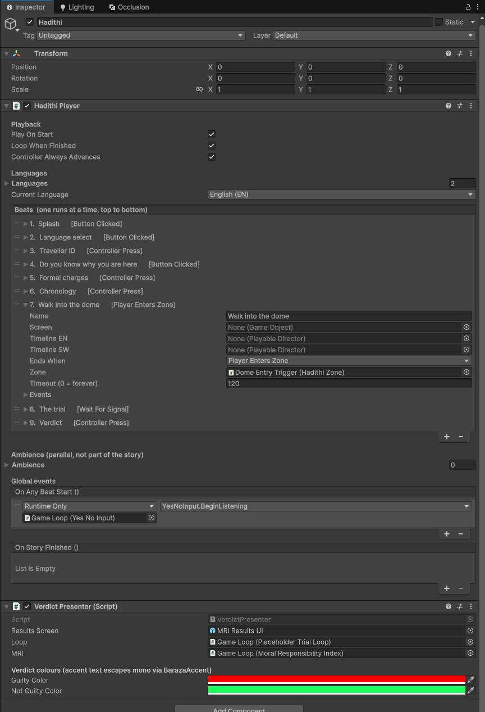
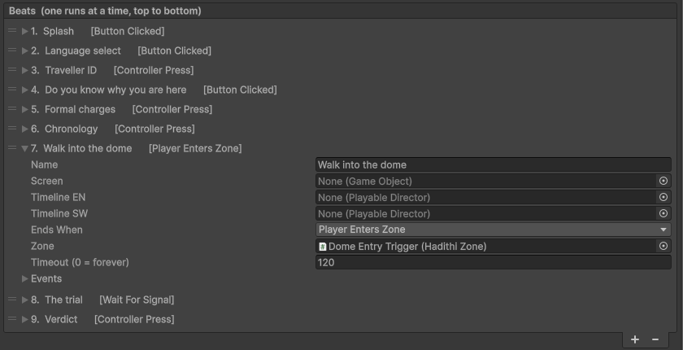

# Hadithi

**Hadithi** (Swahili for "story") is a designer friendly story engine for Unity.
You author an entire story in the Inspector, on one component, as one reorderable
list of Beats. No code, no ID matching, no extra assets in the authoring path.

Built by [SeedeXR](https://github.com/SeedeXR) for the VR courtroom drama
Baraza and reused across SeedeXR story driven projects.

## Why Hadithi

Story frameworks tend to scatter a narrative across many assets and handler
objects, which makes the story hard to read and hard to bend to custom needs.
Hadithi keeps the whole story in one visible place and needs only three concepts:

1. **A Beat shows a Screen** (optional) and/or **plays a Timeline** (optional,
   one slot per language).
2. **"Ends when" decides how the story moves on.** Six plain language choices:
   Button Clicked, Controller Press, Timeline Finishes, Player Enters Zone,
   Wait Seconds, Wait For Signal.
3. **On Beat Start / On Beat End** run anything extra: standard UnityEvents,
   the same concept as a Button's OnClick.

Beats run strictly one at a time, top to bottom: reading the list IS reading the
story. Things that should run in parallel and loop (background music, ambient
effects, a light animation) go in the separate **Ambience** list instead.

## Install

Unity Package Manager > Add package from git URL:

```
https://github.com/SeedeXR/hadithi.git
```

Requires Unity 6000.0 or newer. No dependencies beyond built in modules and uGUI.

## Quick start

1. Add **SeedeXR > Hadithi Player** to an empty GameObject in your scene.
2. Press **+** under Beats, give the beat a name, drag a screen GameObject into
   Screen, and choose how it ends.
3. Repeat until your story reads top to bottom. Press Play.



*The Inspector above is the real story of Baraza VR, the project Hadithi was
extracted from: nine beats, top to bottom.*

## Concepts in detail

### Beats



| Field | Meaning |
|---|---|
| Name | Readable label, shown in the list header |
| Screen | GameObject shown while the beat is active, hidden when it ends |
| Timelines | One PlayableDirector slot per language in your Languages list. An empty slot falls back to the first language |
| Ends when | How the beat completes (see below) |
| On Beat Start / End | UnityEvents fired at the beat's boundaries |

End conditions:

| Ends when | Completes on | Extra fields |
|---|---|---|
| Button Clicked | any listed uGUI Button is clicked | Buttons list |
| Controller Press | `RequestAdvance()` is called (wire your controller input to it) | none |
| Timeline Finishes | the active language timeline reaches its end | none |
| Player Enters Zone | a HadithiZone reports entry | Zone, optional timeout |
| Wait Seconds | a timer elapses | Seconds |
| Wait For Signal | something calls `Signal()` | optional timeout |

### Ambience

Parallel entries that are not part of the story: each has a thing to play (an
AudioSource, a PlayableDirector, or a GameObject to activate), a Play On Story
Start toggle and a Loop toggle. Use beat events to start or stop them at story
moments (for example, dim music during a verdict).

### Languages

Add as many languages as you want, each with a display name and a short code.
The first language is the default and the fallback for any empty timeline slot.
Wire your language selection UI to `SetLanguage(name or code)`: a plain
UnityEvent, no code.

### Custom mechanics: the Wait For Signal seam

Anything the built in conditions do not cover becomes a Wait For Signal beat:

- On Beat Start fires your mechanic (any component, any method, via the event).
- Your mechanic, when finished, calls `HadithiPlayer.Signal()`: wireable from its
  own UnityEvent, still no code.

A whole minigame, a dialogue subprocess or a puzzle integrates with those two
wires. The engine never needs to know what it is waiting for.

## Public API

| Member | Purpose |
|---|---|
| `Play()` / `StopStory()` | Start or stop the story |
| `Advance()` | Force the current beat to end now |
| `RequestAdvance()` | Polite advance: honored on Controller Press beats, and on Button Clicked beats when the safety fallback is on, ignored otherwise |
| `Signal()` | Complete a Wait For Signal beat |
| `JumpTo(index)` / `JumpTo(name)` | Jump to a beat while playing (testing, or simple branching) |
| `PlayFrom(index)` | Start the story at a beat; earlier beats' events are fast forwarded so world state stays consistent |
| `SetLanguage(index)` / `SetLanguage(nameOrCode)` | Switch the active language |
| `onAnyBeatStart` (event) | Fired for every beat, useful for one time wiring such as re arming input |

## Testing tools

Every beat row has a **play button** on its right edge. Click it to start the
story from exactly that beat: in Play Mode it jumps there immediately, and in
Edit Mode it enters Play Mode for you and begins at the chosen beat. Earlier
beats' events are fast forwarded first, so anything they set up (an activated
group, a changed light) is in place when your beat starts.

The Inspector also warns inline when a beat is missing something it needs
(a zone, a button, a screen).

## License

MIT. See LICENSE.md.
